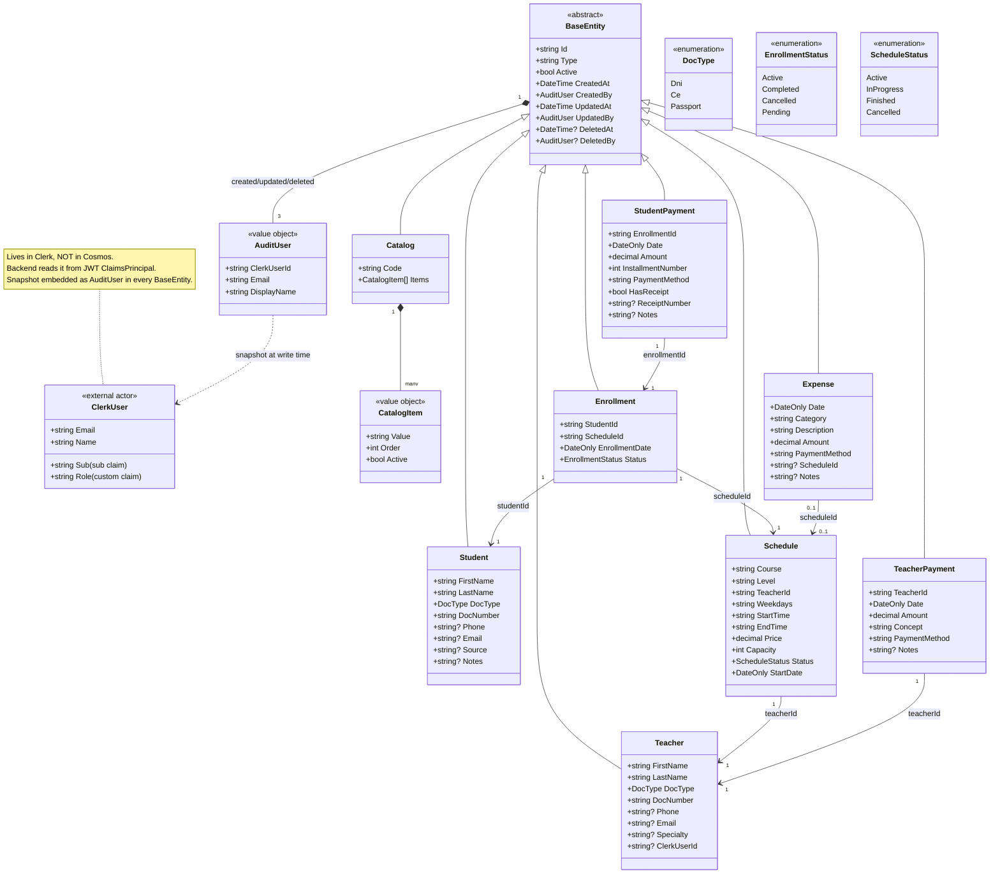

# Class Diagram — Domain Model

```mermaid
classDiagram
    direction TB

    class BaseEntity {
        <<abstract>>
        +string Id
        +string Type
        +bool Active
        +DateTime CreatedAt
        +AuditUser CreatedBy
        +DateTime UpdatedAt
        +AuditUser UpdatedBy
        +DateTime? DeletedAt
        +AuditUser? DeletedBy
    }

    class AuditUser {
        <<value object>>
        +string ClerkUserId
        +string Email
        +string DisplayName
    }

    class ClerkUser {
        <<external actor>>
        +string Sub (sub claim)
        +string Email
        +string Name
        +string Role (custom claim)
    }

    note for ClerkUser "Lives in Clerk, NOT in Cosmos.<br/>Backend reads it from JWT ClaimsPrincipal.<br/>Snapshot embedded as AuditUser in every BaseEntity."

    class Catalog {
        +string Code
        +CatalogItem[] Items
    }

    class CatalogItem {
        <<value object>>
        +string Value
        +int Order
        +bool Active
    }

    class Student {
        +string FirstName
        +string LastName
        +DocType DocType
        +string DocNumber
        +string? Phone
        +string? Email
        +string? Source
        +string? Notes
    }

    class Teacher {
        +string FirstName
        +string LastName
        +DocType DocType
        +string DocNumber
        +string? Phone
        +string? Email
        +string? Specialty
        +string? ClerkUserId
    }

    class Schedule {
        +string Course
        +string Level
        +string TeacherId
        +string Weekdays
        +string StartTime
        +string EndTime
        +decimal Price
        +int Capacity
        +ScheduleStatus Status
        +DateOnly StartDate
    }

    class Enrollment {
        +string StudentId
        +string ScheduleId
        +DateOnly EnrollmentDate
        +EnrollmentStatus Status
    }

    class StudentPayment {
        +string EnrollmentId
        +DateOnly Date
        +decimal Amount
        +int InstallmentNumber
        +string PaymentMethod
        +bool HasReceipt
        +string? ReceiptNumber
        +string? Notes
    }

    class TeacherPayment {
        +string TeacherId
        +DateOnly Date
        +decimal Amount
        +string Concept
        +string PaymentMethod
        +string? Notes
    }

    class Expense {
        +DateOnly Date
        +string Category
        +string Description
        +decimal Amount
        +string PaymentMethod
        +string? ScheduleId
        +string? Notes
    }

    class DocType {
        <<enumeration>>
        Dni
        Ce
        Passport
    }

    class EnrollmentStatus {
        <<enumeration>>
        Active
        Completed
        Cancelled
        Pending
    }

    class ScheduleStatus {
        <<enumeration>>
        Active
        InProgress
        Finished
        Cancelled
    }

    BaseEntity <|-- Catalog
    BaseEntity <|-- Student
    BaseEntity <|-- Teacher
    BaseEntity <|-- Schedule
    BaseEntity <|-- Enrollment
    BaseEntity <|-- StudentPayment
    BaseEntity <|-- TeacherPayment
    BaseEntity <|-- Expense

    BaseEntity "1" *-- "3" AuditUser : created/updated/deleted
    AuditUser ..> ClerkUser : snapshot at write time

    Catalog "1" *-- "many" CatalogItem
    Schedule "1" --> "1" Teacher : teacherId
    Enrollment "1" --> "1" Student : studentId
    Enrollment "1" --> "1" Schedule : scheduleId
    StudentPayment "1" --> "1" Enrollment : enrollmentId
    TeacherPayment "1" --> "1" Teacher : teacherId
    Expense "0..1" --> "0..1" Schedule : scheduleId
```