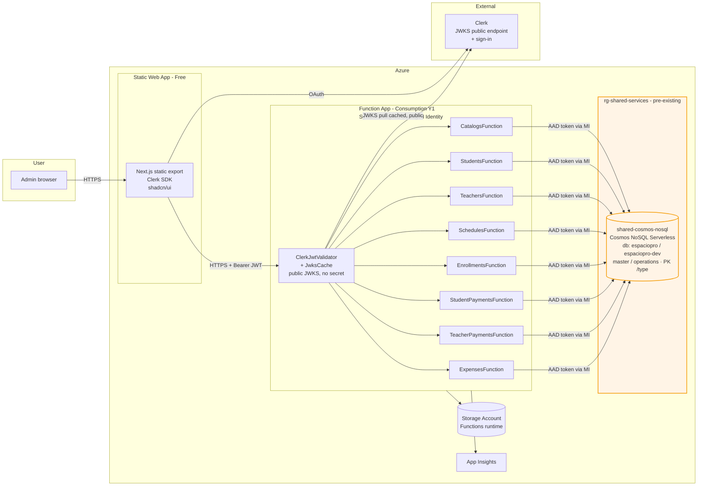

# Component Diagram — System Architecture

```mermaid
flowchart LR
    subgraph User
        U[Admin browser]
    end

    subgraph Azure
        subgraph SWA[Static Web App - Free]
            FE[Next.js static export<br/>Clerk SDK<br/>shadcn/ui]
        end

        subgraph FUNC[Function App - Consumption Y1<br/>System-assigned Managed Identity]
            JWT[ClerkJwtValidator<br/>+ JwksCache<br/>public JWKS, no secret]
            CAT[CatalogsFunction]
            STU[StudentsFunction]
            TCH[TeachersFunction]
            SCH[SchedulesFunction]
            ENR[EnrollmentsFunction]
            PAY[StudentPaymentsFunction]
            TPY[TeacherPaymentsFunction]
            EXP[ExpensesFunction]
        end

        subgraph SHARED[rg-shared-services - pre-existing]
            COSMOS[(shared-cosmos-nosql<br/>Cosmos NoSQL Serverless<br/>db: espaciopro / espaciopro-dev<br/>master / operations · PK /type)]
        end

        STORAGE[(Storage Account<br/>Functions runtime)]
        AI[App Insights]
    end

    subgraph External
        CLERK[Clerk<br/>JWKS public endpoint<br/>+ sign-in]
    end

    U -->|HTTPS| FE
    FE -->|OAuth| CLERK
    FE -->|HTTPS + Bearer JWT| JWT
    JWT -->|JWKS pull cached, public| CLERK
    JWT --> CAT & STU & TCH & SCH & ENR & PAY & TPY & EXP
    CAT & STU & TCH & SCH & ENR & PAY & TPY & EXP -->|AAD token via MI| COSMOS
    FUNC --> STORAGE
    FUNC --> AI

    classDef shared fill:#fff4e6,stroke:#f59e0b,stroke-width:2px
    class SHARED,COSMOS shared
```
