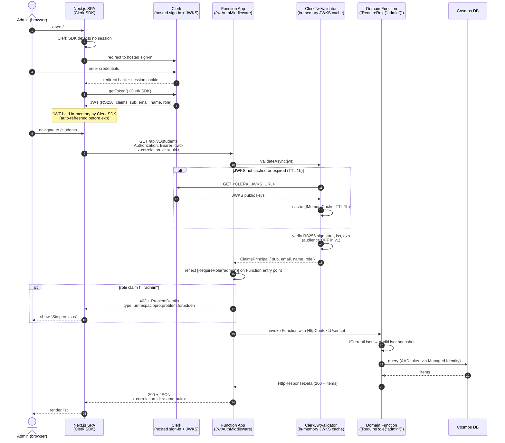
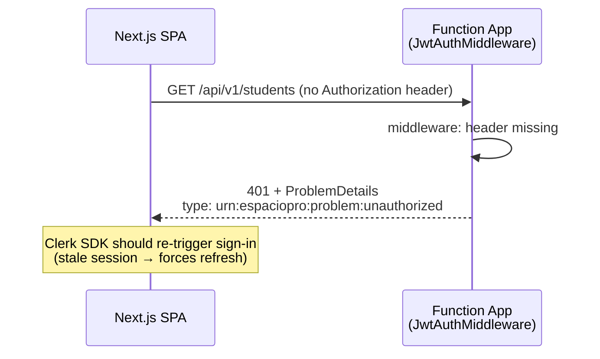
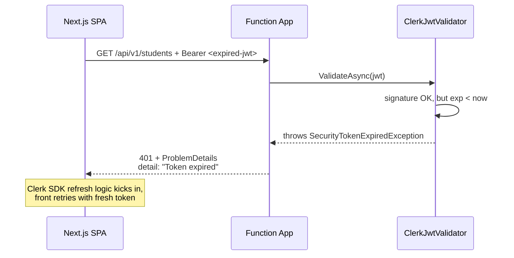
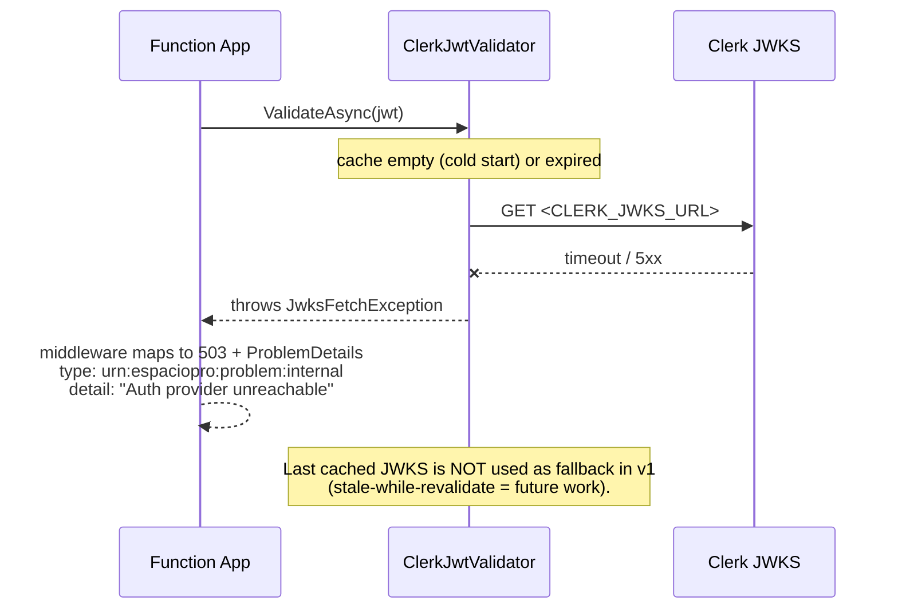
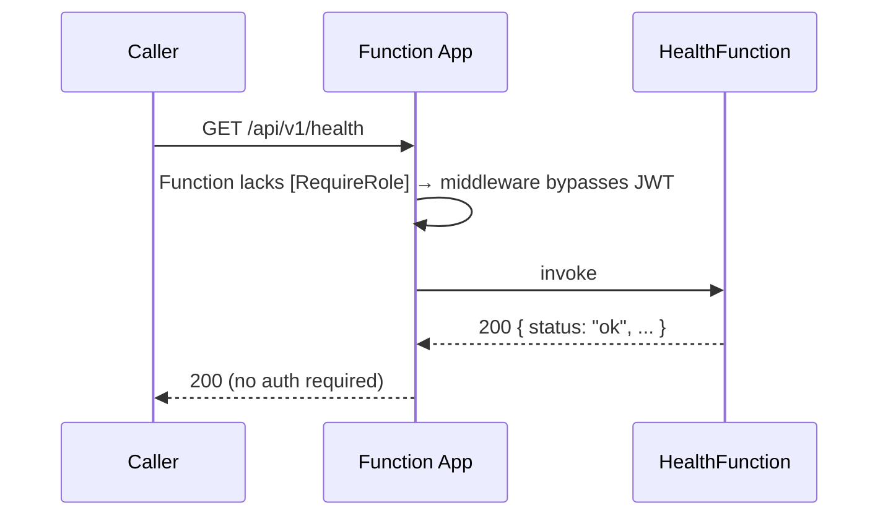

# Sequence Diagram — Authentication & Authorization

> Companion to `02-architecture.md` §3 (auth flow) and `07-api-contract-cheatsheet.md` §10 (auth header).
> Covers: sign-in via Clerk, JWT acquisition, JWKS validation in Function App, role gate.

---

## 1. Happy path — first request after sign-in

---

## 2. Failure paths

### 2.1 Missing or malformed JWT

### 2.2 Invalid signature / expired JWT

### 2.3 JWKS endpoint unreachable

---

## 3. Anonymous endpoint (`/api/v1/health`)

> Health is the only anonymous endpoint in v1. OpenAPI spec endpoint (`/api/openapi/v3.json`) is also anonymous — same bypass mechanism (no `[RequireRole]` on its host Function).

---

## 4. Notes

- **No Clerk Backend API calls in v1.** All validation is asymmetric (public JWKS). Backend never holds a Clerk Secret Key → no Key Vault.
- **JWKS cache TTL = 1 hour**, `IMemoryCache` (in-process, per Function instance). Acceptable cold-start cost: 1 extra HTTPS roundtrip every ~hour per instance.
- **Audience validation is OFF** in v1. Clerk JWTs do not include `aud` by default. To turn it on, configure Clerk JWT template + `ClerkJwtValidator.ValidateAudience = true`.
- **Role claim source**: Clerk Dashboard → Sessions → Custom claims: `{ "role": "{{user.public_metadata.role}}" }`. `public_metadata.role` set manually per user.
- **Correlation propagation**: `x-correlation-id` is generated by frontend if absent (`client.ts`), echoed by backend on response. See `07-api-contract-cheatsheet.md` §9.
