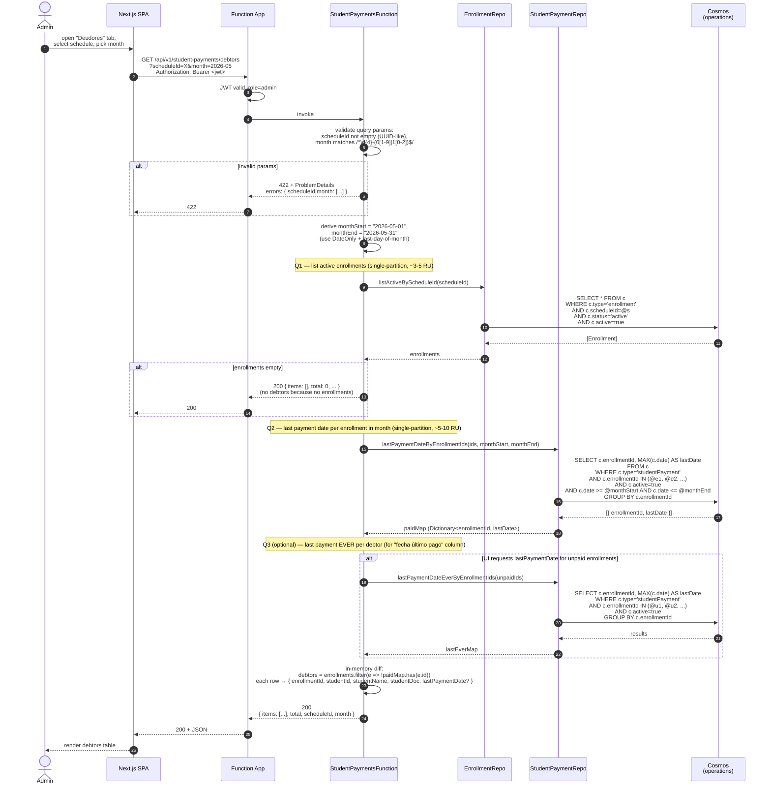

# Sequence Diagram — Debtors Query (per Schedule, per Month)

> Companion to `01-domain-model.md` §3.6 (debtors business rule), `04-api-design.md` §6.2 (query plan), and `02-architecture.md` §6.2.
> Endpoint: `GET /api/v1/student-payments/debtors?scheduleId=X&month=YYYY-MM`
> Used by: M6 (debtors list view) and M9 (dashboard composition).

---

## 1. Happy path



---

## 2. Response shape

```jsonc
{
  "scheduleId": "<guid>",
  "month": "2026-05",
  "items": [
    {
      "enrollmentId": "<guid>",
      "studentId": "<guid>",
      "studentName": "Diego Mejia",
      "studentDoc": "DNI 12345678",
      "lastPaymentDate": "2026-04-15"
    },
    {
      "enrollmentId": "<guid>",
      "studentId": "<guid>",
      "studentName": "Ana López",
      "studentDoc": "DNI 87654321",
      "lastPaymentDate": null
    }
  ],
  "total": 2,
  "summary": {
    "enrolledActive": 12,
    "paid": 10,
    "debtors": 2
  }
}
```

> `summary.enrolledActive` is the universe; `summary.debtors` = `total`. `paid = enrolledActive - debtors`.
> Pagination NOT applied — debtors per schedule per month is bounded (~typical schedule capacity 20-30).

---

## 3. Edge cases

### 3.1 Schedule not found / inactive
The endpoint does NOT verify the schedule exists. If `scheduleId` is bogus, returns `{ items: [], total: 0 }`. Rationale: 1 fewer RU; UI already validates schedule selection upstream. **[DECISION NEEDED if UX requires explicit 404]**

### 3.2 Cross-month payment edge case
A payment with `date = '2026-04-30'` does NOT count for May. UI shows `lastPaymentDate = '2026-04-30'` in the May debtors view, signaling "paid recently but not this month".

### 3.3 Payment with `active=false` (soft-deleted)
Excluded from Q2 / Q3 (`c.active=true` filter). A student whose only May payment was soft-deleted appears as a debtor.

### 3.4 Multiple payments same month
Q2 uses `MAX(c.date)` so the latest payment date wins. Whether multiple payments for same `installmentNumber` is allowed is a UI warning, not a server constraint (see `01-domain-model.md` §3.6 rules).

---

## 4. Cost summary

| Step | Query | Container | Estimated RU |
|---|---|---|---|
| Q1 | List active enrollments | operations (PK=enrollment) | 3-5 |
| Q2 | Payments in month, grouped | operations (PK=studentPayment) | 5-10 |
| Q3 (opt) | Last payment ever | operations (PK=studentPayment) | 3-5 |
| **Total** | | | **~10-20 RU** |

Cosmos serverless cost: < $0.000005 per call.

---

## 5. Notes

- **Cross-partition reads avoided**: both Q1 and Q2 are single-partition because they filter by `c.type=`.
- **`IN` clause limit**: Cosmos supports up to 1000 items in `IN`. A single schedule has well under that. No batching needed in v1.
- **Composite index**: `(scheduleId, status, active)` on `enrollment` and `(enrollmentId, date, active)` on `studentPayment` recommended for sub-millisecond queries. See `02-architecture.md` §10 closure (indexing policy decision).
- **Caching**: results are NOT cached server-side. The dashboard composition (`/schedules/{id}/dashboard`) reuses the same query logic but composes additional data. Sharing the implementation lives in `EspacioPro.Application/Debtors/DebtorsQuery.cs`.
