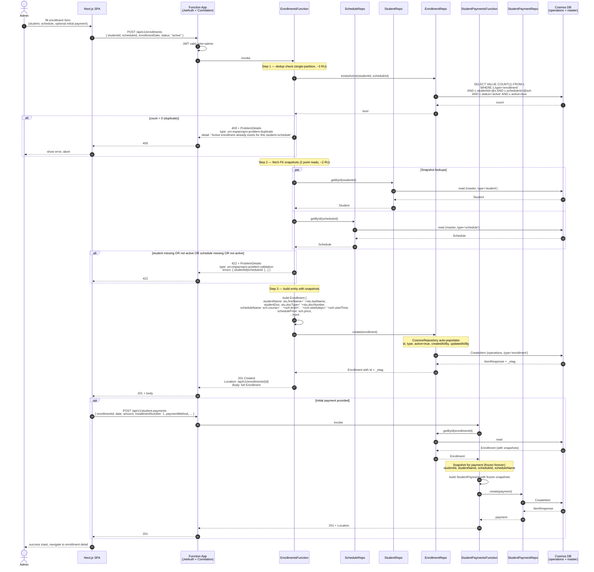
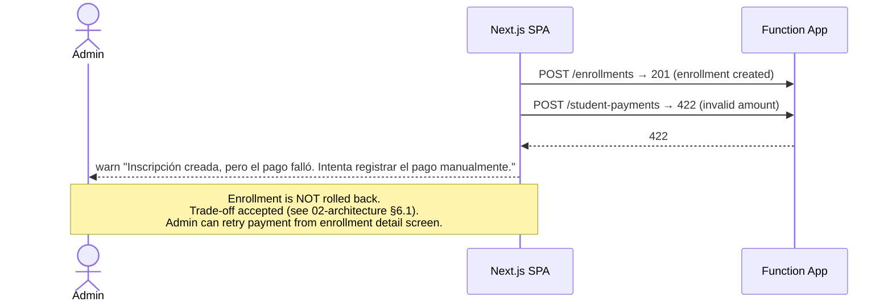
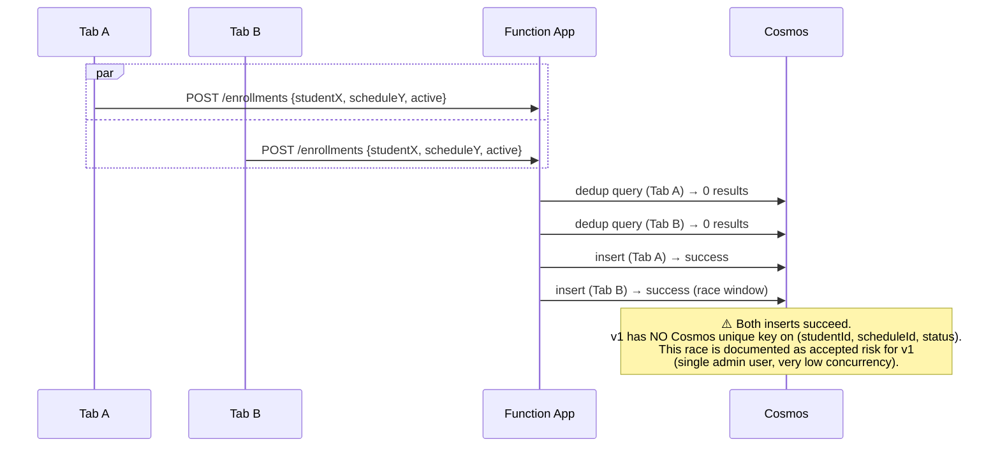

# Sequence Diagram — Enrollment Creation (with optional initial payment)

> Companion to `02-architecture.md` §6.1 and `04-api-design.md` §5.5 / §5.6.
> Covers: dedup validation, snapshot population, optional 2nd call for initial payment.
> Decision: enrollment + payment are **two separate calls**, NOT atomic. Trade-off documented in `02-architecture.md` §6.1.

---

## 1. Happy path — new enrollment + initial payment

---

## 2. Failure path — payment fails after enrollment succeeds

---

## 3. Edge case — concurrent duplicate creation

> **If duplicate-active race becomes real**: add a server-side lock via Cosmos optimistic concurrency on a "lock doc", or define a Cosmos unique key over a synthetic `enrollmentDedupKey = studentId + '_' + scheduleId` populated only when `status='active' AND active=true`. Out of scope v1.

---

## 4. Notes

- **Dedup check** is a separate query before insert. Cost: ~3 RU. Acceptable.
- **Snapshot freshness**: `studentName`, `scheduleName`, `schedulePrice` are written at create time and refreshed on `PUT /enrollments/{id}`. Stale snapshots accepted (same audit pattern as `AuditUser`). See `04-api-design.md` §4.2.
- **Payment snapshots are FROZEN**: `studentName`, `scheduleName` on `StudentPayment` never refresh — payment is a historical fact.
- **Concurrency control on PUT**: `Enrollment` PUT requires `If-Match` header (cheatsheet §7). POST does not.
- **Total RU per happy path**: ~3 (dedup) + ~2 (snapshots) + ~5 (insert) = **~10 RU per enrollment**. With initial payment: +5 RU = ~15 RU total.
