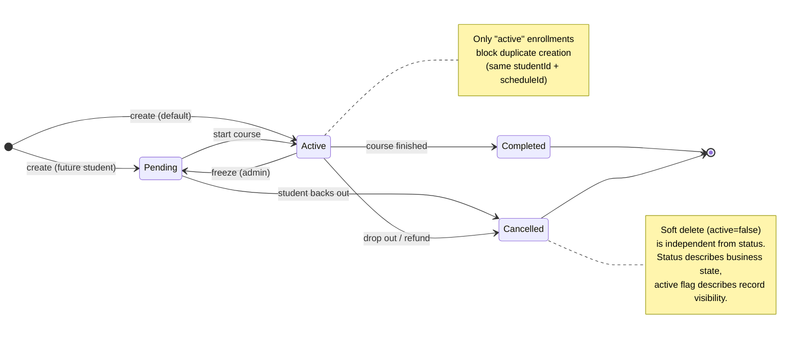

# State Diagram — Enrollment

> Status values are code-level enums in English on the wire (see `01-domain-model.md` §9 and `07-api-contract-cheatsheet.md` §5). UI labels are Spanish via i18n map.

```mermaid
stateDiagram-v2
    direction LR

    [*] --> Pending : create (future student)
    [*] --> Active : create (default)

    Pending --> Active : start course
    Pending --> Cancelled : student backs out

    Active --> Completed : course finished
    Active --> Cancelled : drop out / refund
    Active --> Pending : freeze (admin)

    Completed --> [*]
    Cancelled --> [*]

    note right of Active
        Only "active" enrollments
        block duplicate creation
        (same studentId + scheduleId)
    end note

    note right of Cancelled
        Soft delete (active=false)
        is independent from status.
        Status describes business state,
        active flag describes record visibility.
    end note
```
